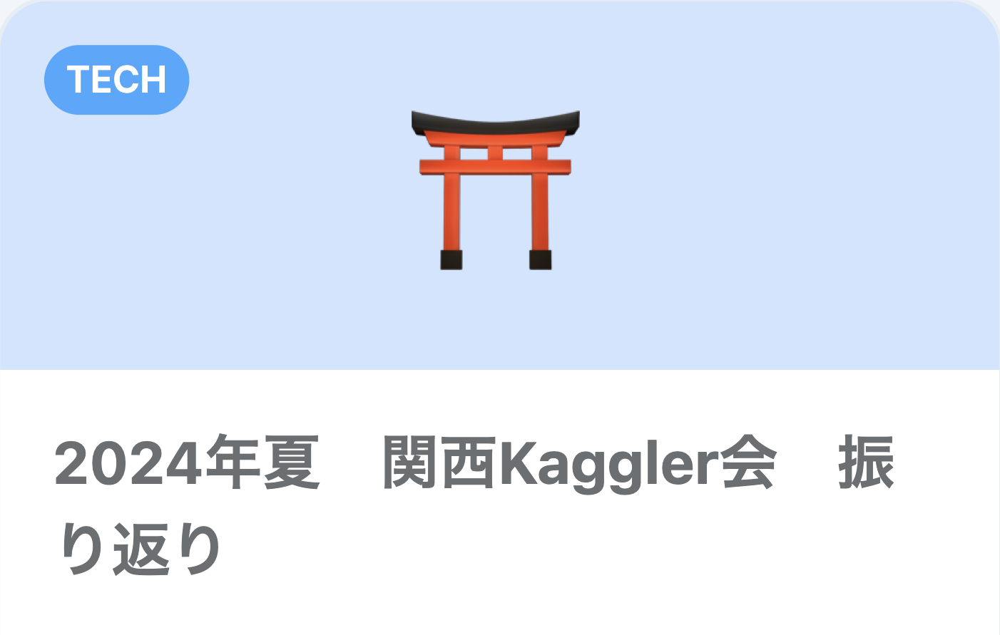
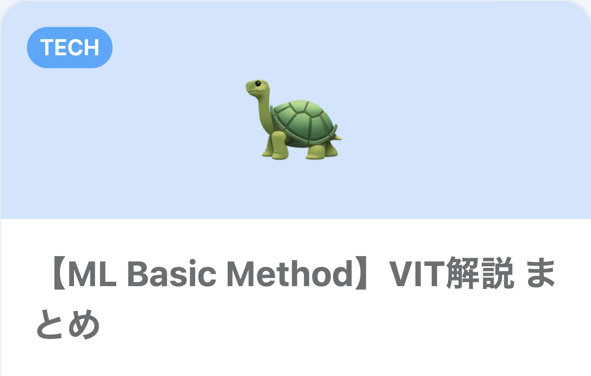
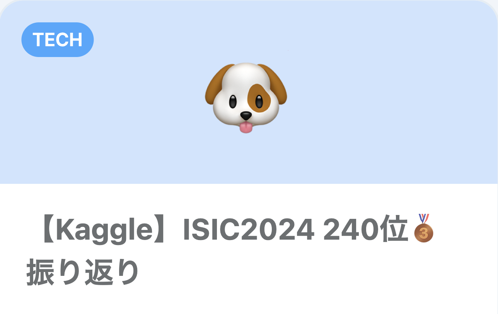

  <!-- 
   -->
  <!-- Like のバッジ -->
  <!--  -->
  <!-- Articles のバッジ -->
  
  <!-- Followers のバッジ -->
  

## Summary
初めまして。 Yuto です。  
現在はメーカーの開発部門で、Pythonを用いたロボットの振動最適化や、PLCラダーによる組み込み開発を行っています。

最近の関心事は機械学習全般、特に画像認識や時系列分析の分野で、趣味でKaggleやデータ分析関連のオフラインイベントに参加しています。
 
 

## Projects

  <!-- 1つ目のプロジェクト -->
  

      

          
2024/09 &nbsp;&nbsp;&nbsp;&nbsp;&nbsp;&nbsp;&nbsp;| 2024/06

      

      <a href="https://example.com" style="flex: 3; display: block; width: 100%; max-width: 600px; height: 200px; background-image: url('./images/ISIC2024_img.png'); background-size: cover; background-position: center; text-align: center; color: white; text-decoration: none; position: relative; padding: 20px; border-radius: 10px; overflow: hidden; margin-right: 20px; transition: transform 0.3s ease, box-shadow 0.3s ease;">
          

              <h1 style="font-size: 2em; margin: 0;">Kaggle ISIC2024</h1>
              
患者情報と皮膚の画像から、提供画像が皮膚がんか どうかを判別するコンペティションに参加。 銅メダル🥉 236位/2739(top8.7%)

          

      </a>
  

  <!-- 2つ目のプロジェクト -->
  

      

          
2024/06 &nbsp;&nbsp;&nbsp;&nbsp;&nbsp;&nbsp;&nbsp;| 2024/04

      

      <a href="https://example.com" style="flex: 3; display: block; width: 100%; max-width: 600px; height: 200px; background-image: url('./images/BirdCLEF2024_img.png'); background-size: cover; background-position: center; text-align: center; color: white; text-decoration: none; position: relative; padding: 20px; border-radius: 10px; overflow: hidden; margin-right: 20px; transition: transform 0.3s ease, box-shadow 0.3s ease;">
          

              <h1 style="font-size: 2em; margin: 0;">Kaggle BirdCLEF2024</h1>
              
世界中の182種類の鳥を鳴き声から判別する コンペティションに参加。 銀メダル🥈 29位/974(top3%)

          

      </a>
  

  <!-- 3つ目のプロジェクト -->
  

      

          
2023/05 &nbsp;&nbsp;&nbsp;&nbsp;&nbsp;&nbsp;&nbsp;| 2022/11

      

      <a href="https://example.com" style="flex: 3; display: block; width: 100%; max-width: 600px; height: 200px; background-image: url('./images/ISIC2024_img.png'); background-size: cover; background-position: center; text-align: center; color: white; text-decoration: none; position: relative; padding: 20px; border-radius: 10px; overflow: hidden; margin-right: 20px; transition: transform 0.3s ease, box-shadow 0.3s ease;">
          

              <h1 style="font-size: 2em; margin: 0;">目覚まし WebApp</h1>
              
家から出るまで鳴り止まない目覚ましアプリ。 スケジュール機能で作業の効率化にも使用中。

          

      </a>
  

## Blogs
2023/06/20から[技術記事](https://zenn.dev/yuto_mo)を投稿しており、現在200記事以上を公開しています。 (2024/03/06より毎日投稿)  
最近は勉強も兼ねて英語で投稿しています。

##### Pick Up

  

    
  

  

    
  

  

    
  

##### 最新記事
<!-- BLOG-POST-LIST:START -->
- [【Statistics Method】t-test explained](https://zenn.dev/yuto_mo/articles/4884edb9de589b)
- [【GitHub】error: pack-objects died of signal 9](https://zenn.dev/yuto_mo/articles/8d751bf4bece1c)
- [【GitHub】Update this repo&#39;s README with latest blog posts with yml file](https://zenn.dev/yuto_mo/articles/bb20804a3a8bd1)
- [【Method for ML】COCO format explained](https://zenn.dev/yuto_mo/articles/05e27632de06bb)
<!-- BLOG-POST-LIST:END -->

## Career

>現在 - 2023/04
- セイコーエプソン株式会社   
Pythonを用いたロボットの振動最適化やPLCラダーによる組み込み開発を行っています。 

>2023/03 - 2021/04
- 岐阜大学  
石川高専から編入後、電気電子情報工学の基礎を学び、研究ではPythonを使用して雷発生時に風車に生じる電流の解析を行いました。

<h3 align="left">Languages and Tools:</h3>

 

 
 
 
 

 
<!--  
  
   -->

<!--   -->
<!--   -->
<!--   -->

<h3 align="left">Connect with me:</h3>

